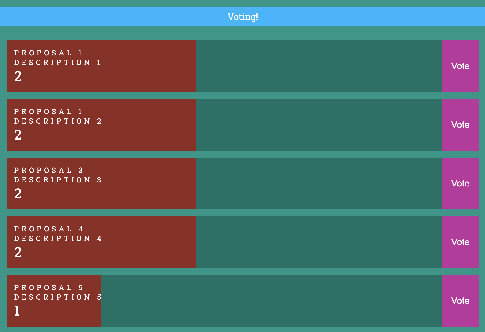

# gun-voting

Real-time distributed voting system embeddable in an iframe using Gun

## Features
- Vanilla JS and Gun.

## Coming soon

- embedded in Wiki document link: https://github.com/amark/gun/wiki/Voting

## ScreenShoot

<!--  -->

[gun-voting Demo](https://gun-voting.netlify.app/) Powered by [GUN](https://gun.eco/)

-------------

#### Credits & Thanks
* [Mark's GUN](https://gun.eco/) and its community!

* [noctisatrae collaboration](https://github.com/noctisatrae)

* [by estebanrfp](https://github.com/estebanrfp)
